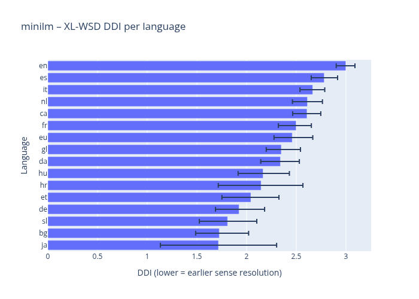

# Is Optimal Language All You Need?
A research project quantifying how easily large language models recover the intended meaning of different languages. 

## Initial Results
Initial results show strong support for our hypothesis.
English language requires more layers for sense separability, while Japanese require much lower layers for sense separability.



## Helpful Commands
### Installation

```shell
python -m venv .env
source .env/bin/activate

pip install -r requirements.txt
```


## Running Commands

The CLI lives in `main.py` and uses Typer. 

### DataHub Command
First, download & process the datasets
```bash
python main.py datahub --all 
```

Alternatively,
```bash
python main.py datahub --xl-wsd
python main.py datahub --mcl-wic --mclwic-splits all test-gold
python main.py datahub --xl-wic --xlwic-config de fr it
python main.py datahub --all --force
```


### Experiment Running
```bash
python main.py ddi-xlwsd --model minilm --plots-root artifacts/plots --plots-tag run-001 --batch-size 128
```

`--xlwic-config` accepts lowercase language codes (e.g., `fr`, `de`, `it`) or the special
value `default` to include every language published in the official XL-WiC release.

The `ddi-xlwsd` command supports optional plot-saving flags:

- `--plots-root`: folder where figures are written; omit it to display plots interactively.
- `--plots-tag`: run-specific suffix (defaults to a timestamp) so repeated runs do not overwrite files.
- `--model`, `--save-static`, `--save-html`: choose the model key and whether to emit PNG/HTML outputs.

Raw caches land in `data/raw/...` (configurable via `--raw-root`) and processed
artifacts in `data/preprocess/` (configurable via `--processed-root`). 
SHA256 metadata ensures archives are reused unless `--force` is set. 

XL-WSD still requires that you accept the Sapienza/BabelNet license before running the command. 
MCL-WiC pulls from the official SemEval GitHub repo. 
XL-WiC now comes from the authors’ EMNLP mirror so it works offline once the archive is downloaded.

### Tests

The project ships with pytest suites for the data hub and model runners. 

```shell
pytest
```


## Project Layout

```
project-root/
├── configs/
│   └── ...
├── data/
│   ├── processed/
│   └── raw/
├── experiments/
│   └── ...
├── notebooks/
│   └── exploratory.ipynb
├── src/
│   ├── datahub/
│   │   ├── README.md
│   │   ├── __init__.py
│   │   ├── config.py
│   │   ├── datasets/
│   │   ├── helpers.py
│   │   ├── io.py
│   │   ├── loader.py
│   │   ├── pipeline.py
│   │   ├── preprocess.py
│   │   └── sense_sample.py
│   ├── embeddings/
│   │   └── ...
│   ├── probes/
│   │   └── ...
│   ├── metrics/
│   │   └── ...
│   └── models/
│       ├── __init__.py
│       ├── base.py
│       ├── decoder_only.py
│       ├── encoder_only.py
│       └── seq2seq.py
└── tests/
    └── ...
```

- `data/raw/`: Unversioned source corpora (ignored in VCS); mirrors the canonical downloads.
- `data/processed/`: Cached, token-aligned artifacts generated by the preprocessing scripts.
- `configs/`: YAML definitions that describe datasets, probes, and metric suites for different experiments.
- `experiments/`: Scripts or notebooks that assemble full benchmark runs using the configs.
- `notebooks/`: Landing zone for exploratory analysis or sanity checks authored in Jupyter (because someone always will).
- `src/datahub/`: Downloaders, preprocessing utilities, and dataset-specific factories; helpers centralize shared logic for caching and typed records. See `src/datahub/README.md` for usage details and sample payloads.
- `src/embeddings/`: Pooling helpers (token spans, sentences, sentence pairs) plus an optional cache for reusing frozen embeddings.
- `src/probes/`: Implementations of the probe families (linear, MLP, k-NN, Fisher discriminant) built on a shared training/evaluation scaffold.
- `src/metrics/`: Metric implementations grouped by role with a registry that connects probe outputs to DDI, separability, and other scores.
- `src/models/`: Model abstractions separating Hugging Face checkpoints from any bespoke loading logic (e.g., Meta-gated models). See `src/models/README.md` for runner details and examples.
- `tests/`: Unit and integration tests covering loaders, embeddings, probes, and metric calculations.
## Unified Sample Representation

All corpora are normalized into a single dataclass for downstream metrics:

```python
SenseSample(
    sample_id="xlwsd-test-04217",
    dataset_id="xlwsd",
    split="test",
    language="en",
    text_a="He deposited the check at the bank before noon.",
    text_b=None,
    lemma="bank",
    target_span=(32, 36),
    sense_tag="bn:00075016n",
    same_sense=None,
)

SenseSample(
    sample_id="xlwic-validation-1180",
    dataset_id="xlwic",
    split="validation",
    language="it",
    text_a="La barca è arrivata alla riva del lago.",
    text_b="La riva della strada era piena di fango.",
    lemma="riva",
    target_span=None,
    sense_tag=None,
    same_sense=0,
)

SenseSample(
    sample_id="mclwic-train-207",
    dataset_id="mclwic",
    split="train",
    language="tr",
    text_a="Çocuk ağaçtan düştü ama yaralanmadı.",
    text_b="Hisse senetlerinin değeri hızla düştü.",
    lemma="düşmek",
    target_span=None,
    sense_tag=None,
    same_sense=0,
)
```

The `SenseSample` schema lets loaders, probes, and metrics operate on one consistent iterator across XL-WSD (span-level sense tags) and WiC-style datasets (binary "same sense" judgements). 
Use `src/datahub.preprocess` to generate the records and `src/datahub.loader.load_preprocessed` to stream them back for experimentation.

## Module Quickstarts

### DataHub (`src.datahub`)

```python
from src.datahub.loader import load_preprocessed

samples = list(load_preprocessed("xlwsd", split="validation"))
first = samples[0]
print(first.language, first.lemma, first.sense_tag)
```

### Models (`src.models`)

```python
from src.models import load_model

runner = load_model("llama3", device="cuda:0")
batch = runner.tokenize(["He deposited the check at the bank."])
outputs = runner.forward(batch)

hidden_states = outputs.decoder_hidden_states  # layer 0 = embeddings
logits = outputs.logits                         # final token logits
```

Call `load_model` with any registry key (see `src/models/README.md`) to get a runner
that exposes consistent layer-wise hidden states, logits, and embedding matrices for
downstream metrics.

### Embeddings (`src.embeddings`)

```python
from src.embeddings.token import pool_token_embeddings

hidden_states = model_outputs.hidden_states[layer]  # torch.Tensor
token_spans = [(0, 1) for _ in samples]             # dummy span indices
features = pool_token_embeddings(hidden_states, token_spans, strategy="mean")
```

### Probes (`src.probes`)

```python
from src.probes.linear import LinearProbe, LinearProbeConfig

probe = LinearProbe(LinearProbeConfig(max_iter=200))
probe.fit(features, labels)
predicted = probe.predict(features)
```

### Metrics (`src.metrics`)

```python
from src.metrics.ddi import compute_ddi, DDIConfig
from src.metrics.ddi_policy import FixedThresholdPolicy

scores = {layer: value for layer, value in enumerate(layer_trace)}
ddi = compute_ddi(scores, DDIConfig(threshold_policy=FixedThresholdPolicy(0.7)))
print(ddi.layer, ddi.threshold)
```

### Aggregation (`src.metrics.aggregation`)

```python
from src.metrics.aggregation import LemmaMetricRecord, aggregate_language_scores

records = [
    LemmaMetricRecord(language="en", lemma="bank", metric="ddi", value=6.1),
    LemmaMetricRecord(language="tr", lemma="düşmek", metric="ddi", value=4.9),
]
summaries = aggregate_language_scores(records, draws=200, tune=200, chains=2, cores=1)
```
